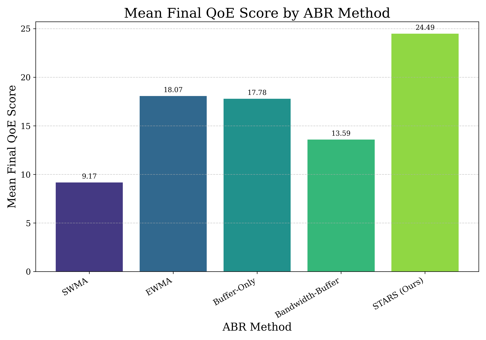
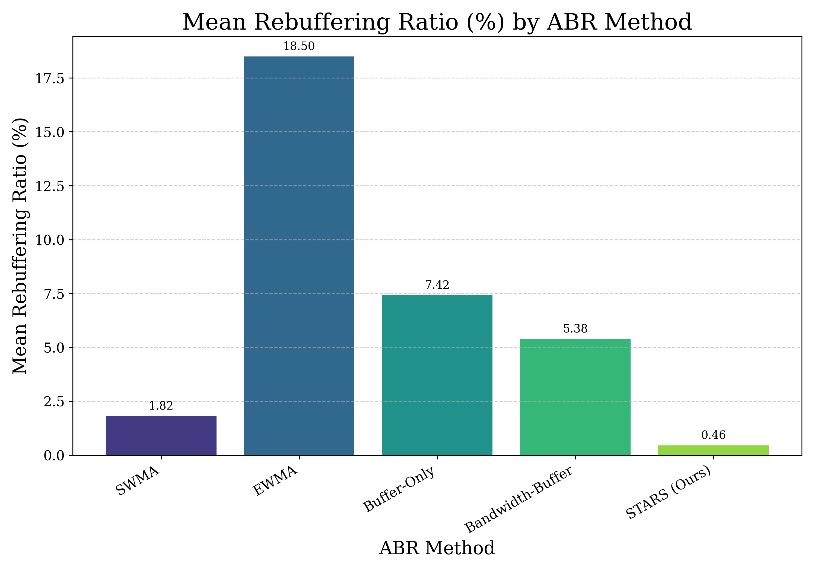

# STARS: STateful Adaptive Rate Selection

**STARS (STateful & Throughput-Aware Adaptive Rate Selection)** is an intelligent HTTP Adaptive Streaming (HAS) system featuring a novel comprehensive rule-based Adaptive Bitrate (ABR) algorithm. This project aims to optimize Quality of Experience (QoE) by dynamically adapting video bitrate to network fluctuations, ensuring smooth and high-quality playback for users.

The system includes an HLS server with AES-encrypted segment delivery, a client-side proxy for decryption and network condition simulation, an hls.js-based web player, and a robust evaluation framework.

**Team Members:** Nuoyan Chen, Ruikang Lin, Zhuofan Chen, Xuanzhe Yu, Qiushi Yao
**Affiliation:** Shanghai Jiao Tong University
**Course:** CS3611 (Computer Networks)

## Features

* **End-to-End HLS Streaming Pipeline:**
    * Video pre-processing using FFmpeg for multi-bitrate HLS segmentation.
    * HTTP server for delivering M3U8 playlists and media segments.
    * AES-128 CBC encryption of video segments for secure transmission.
* **Client-Side Proxy with Advanced Capabilities:**
    * Intercepts and modifies HLS manifest requests.
    * Performs on-the-fly decryption of AES-encrypted video segments.
    * Integrates a high-fidelity network simulator to emulate various bandwidth conditions for robust ABR testing.
* **STARS ABR Algorithm:**
    * A comprehensive, rule-based ABR algorithm.
    * Leverages stateful network analysis (EWMA, SWMA, latest throughput, network trends, volatility).
    * Employs proactive risk management: slow/stuck segment penalties, PANIC mode, preemptive downgrades.
    * Features dynamic buffer loss estimation for stable up-switches.
* **Real-time QoE Monitoring & ABR Control:**
    * hls.js-based web player for video playback.
    * WebSocket communication for sending QoE metrics (buffer level, stalls, switches) from player to client backend, and ABR decisions from backend to player.
    * Detailed QoE calculation based on playback quality, rebuffering penalties, and switching penalties.
* **Automated Testing Framework:**
    * Supports running experiments with different ABR algorithms and network scenarios.
    * Generates detailed logs and QoE summary files for analysis.

## System Architecture


Our system consists of a video processing pipeline, an HLS server, and a client application. The client includes a local proxy (handling decryption and network simulation), an ABR manager (implementing STARS and other algorithms), a QoE manager, and communicates with an hls.js-based web player via WebSockets.

## Project Structure

```
Stream-Smart-ABR/
├── src/                  # Source code
│   ├── ABR.py            # ABRManager class and decision logics
│   ├── AES.py            # AES encryption/decryption utilities
│   ├── QoE.py            # QoEMetricsManager class
│   ├── client.py         # Main client application, proxy, WebSocket server
│   ├── control.py        # Automated test runner script
│   ├── network_simulator.py # Network bandwidth simulation logic
│   ├── player.html       # Web-based HLS player
│   ├── psnr_calculator.py # Utility for PSNR calculation (if used offline)
│   ├── segment_video.py  # Script for video segmentation using FFmpeg
│   ├── server.py         # HTTP HLS server
├── utils/
│   ├── plot.py           # Script to generate plots from test results
│   ├── control.py        # Automated test runner script
│   ├── stable_bw.py      # Script for testing stable bandwith tests and plotting
│   └── psnr_calculator.py # Codes for calculating PSNR
├── test/                 # Directory for storing test case results
├── plots/                # Directory for generated charts
├── video_segments/       # Output directory for HLS segments and playlists
├── img/                   # For poster images
├── docs/                 # Documentation
├── bbb_sunflower.mp4     # Source video file (after download and rename)
├── aes.key               # AES encryption key
└── README.md             # This file
```

## Setup and Usage

### Prerequisites

* Python 3.x
* FFmpeg (see `docs/ffmpeg_tutorial` for installation)
* Required Python packages: `requests`, `numpy`, `pandas`, `matplotlib`, `seaborn`, `websockets`, `cryptography`
    ```bash
    pip install requests numpy pandas matplotlib seaborn websockets cryptography
    ```
    (If using a virtual environment, activate it first.)

### Test Environment Configuration

#### Server-Side Setup

1.  **Download Test Video:**
    * The **Big Buck Bunny** animation is used as the high-quality source video.
    * Download the **2160p_30fps** version (recommended for full quality range):
        [Download 2160p BBB Sunflower MP4](https://download.blender.org/demo/movies/BBB/bbb_sunflower_2160p_30fps_normal.mp4.zip)
    * Alternatively, the **1080p_30fps** version can be used:
        [Download 1080p BBB Sunflower MP4](https://download.blender.org/demo/movies/BBB/bbb_sunflower_1080p_30fps_normal.mp4.zip)
    * After downloading and unzipping, place the video file in the project's root folder and rename it to `bbb_sunflower.mp4`.

2.  **Video Segmentation and Transcoding:**
    * Ensure FFmpeg is installed and accessible in your system's PATH.
    * Run the segmentation script from the project's root directory:
        ```bash
        python src/segment_video.py
        ```
    * This process will create multi-bitrate HLS segments and playlists under the `video_segments/bbb_sunflower/` directory. It may take several minutes.

3.  **Generate AES Key (If not present):**
    * An `aes.key` file is required for encryption/decryption. If you don't have one, you can generate a 16-byte (128-bit) or 32-byte (256-bit) random key. For example, using Python:
        ```python
        import os
        key = os.urandom(16) # 16 bytes for AES-128
        with open("aes.key", "wb") as f:
            f.write(key)
        print("AES key generated and saved to aes.key")
        ```
    * Place `aes.key` in the project's root directory.

4.  **Run the HLS Server:**
    * From the project's root directory, execute:
        ```bash
        python src/server.py
        ```
    * *Note for Windows users*: Administrator privileges might be required. Consider running your terminal (e.g., VS Code integrated terminal) as an administrator.
    * If the server fails to start, try changing the listening port (`PORT` variable in `src/server.py`, default is 8081).

#### Client-Side Setup & Running Experiments

1.  **Configure Client:**
    * Open `src/client.py`.
    * Ensure `SERVER_HOST` is set correctly (e.g., `'127.0.0.1'` for local testing).
    * Ensure `SERVER_PORT` matches the port used by `server.py` (default 8081).
    * Other parameters like `LOCAL_PROXY_PORT`, `WEBSOCKET_PORT`, `VIDEO_TO_STREAM_NAME` can also be configured if needed.

2.  **Run a Single Experiment:**
    * To run a specific test case (e.g., ABR method 6 with network scenario 2, saving results to `test/case_6_2`):
        ```bash
        python src/client.py 6 2 ./test/case_6_2 
        ```
    * The client will start its local proxy and WebSocket server, then open the player in your default web browser. The experiment will run for a predefined duration (e.g., 100 seconds in `client.py`).
    * *Note for Windows users*: Administrator privileges might be required.

3.  **Run Automated Batch Experiments:**
    * The `utils/control.py` script can be used to run multiple experiments with different ABR methods and network scenarios automatically.
    * Modify the `parameter_combinations` list in `utils/control.py` to define the tests you want to run. For example:
        ```python
        parameter_combinations = []
        # Test STARS (method 6) across all 9 network environments
        for j in range(1, 10): # Environments 1 to 9
            parameter_combinations.append([6, j])
        # Test other methods (e.g., 2 to 5) on specific environments
        # for i in range(2, 6):
        #     parameter_combinations.append([i, 3]) # Test methods 2-5 on network env 3
        ```
    * Execute the control script from the project's root directory:
        ```bash
        python utils/control.py
        ```
    * Results for each combination (`case_{method_id}_{env_id}`) will be saved in the `./test/` directory (or as specified in `control.py`).

## Plotting Results

After running experiments, you can generate performance comparison charts using `utils/plot.py`:

1.  **Configure `plot.py`**:
    * Set `RESULTS_BASE_DIR` to your results directory (e.g., `./test`).
    * Update `DECISION_METHODS` and `NETWORK_ENVIRONMENTS` lists to match the experiments you want to plot.
    * Modify `METHOD_LABELS` if needed.
    * Ensure `OUTPUT_DIR` is set to where you want charts saved.
2.  **Run the script**:
    ```bash
    python utils/plot.py
    ```
    This will generate various line charts, bar charts, heatmaps, and radar charts in the specified `OUTPUT_DIR`.

## STARS Algorithm Highlights

* **Stateful Network Analysis**: Dynamically interprets EWMA/SWMA, latest throughput, volatility, and trends.
* **Proactive Risk Management**: Employs slow/stuck segment penalties, PANIC mode, and preemptive downgrades.
* **Smart Up-Switching**: Uses dynamic buffer loss estimation considering bitrate jump magnitude and stricter criteria for extreme jumps.

## Results Summary

STARS consistently achieved the highest average QoE and lowest rebuffering ratio across diverse network simulations, while maintaining competitive PSNR.

|||
|:---:|:---:|

## Future Work

* Explore "soft classification" or fuzzy logic for network state assessment.
* Investigate lightweight machine learning models for predictive enhancements.
* Conduct subjective user studies to correlate objective QoE with perceived satisfaction.

**Key additions and considerations in this README:**

  * **Clear Title and Introduction**: Briefly explains what STARS is and its goals.
  * **Features Section**: Highlights the main capabilities of your system and algorithm.
  * **System Architecture**: Placeholder for you to add your diagram.
  * **Project Structure**: Gives an overview of the codebase.
  * **Setup and Usage**:
      * Clear prerequisites.
      * Step-by-step instructions for server setup (video download, segmentation, AES key, running server).
      * Step-by-step instructions for client setup and running both single and batch experiments.
  * **Plotting Results**: Instructions on how to use your `plot.py`.
  * **STARS Algorithm Highlights**: A concise summary of what makes your algorithm special.
  * **Results Summary (Example)**: A placeholder for you to put your main conclusions.
  * **Future Work**: Standard section for academic projects.
  * **Markdown Formatting**: Uses headers, bullet points, and code blocks for readability.