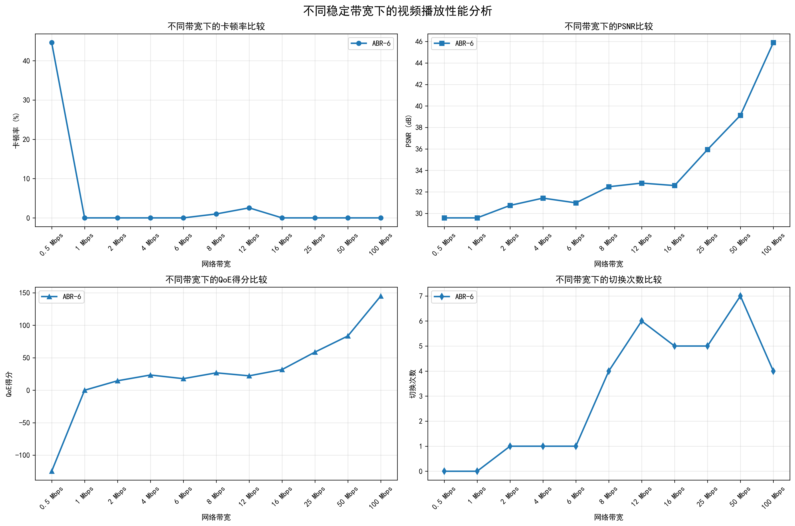
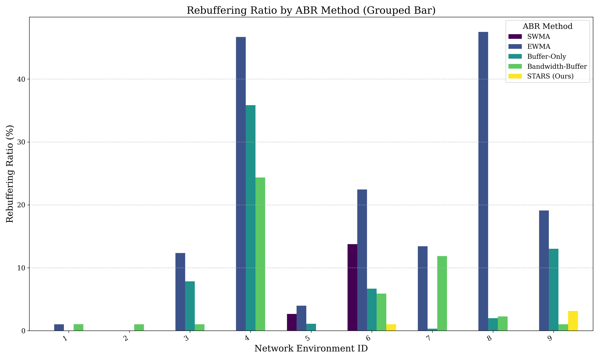
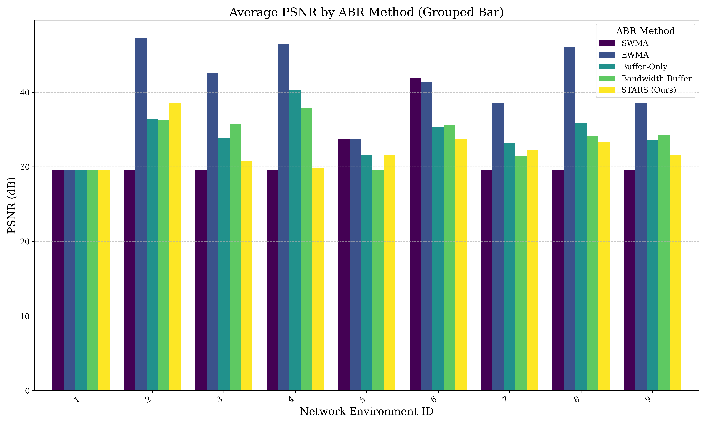
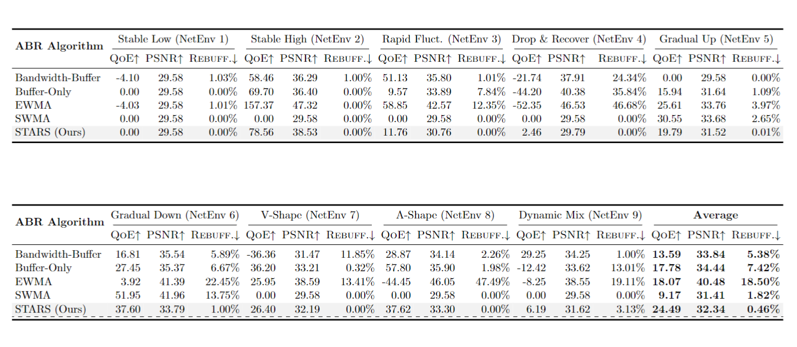

# 自适应码率算法测试报告

## 一、测试目的

本测试用于评估我们自己设计的 **STARS (Stateful Adaptive Rate Selection for Enhanced QoE)** 算法在不同网络带宽条件下的稳定性与画质表现，并通过与其他基于带宽、缓冲区算法进行对比，分析STARS的优越性。

## 二、测试方法

- **测试范围**：带宽从 0.5 Mbps 至 100 Mbps，共覆盖多个典型场景。
- **核心指标**：
  - **卡顿率（%）**：衡量播放过程中卡顿时间占比
  - **PSNR（dB）**：衡量视频图像质量，值越大质量越好
  - **平均码率**：播放过程中实际选用的视频码率（Kbps）

## 三、结果分析

### 不同带宽下指标趋势图

### 指标对比数据表

| 带宽 | 卡顿率（%） | 卡顿次数 | PSNR (dB) | 平均码率 (Kbps) |
|------|-------------|----------|-----------|-----------------|
| 0.5 Mbps | 44.61% | 10 | 29.58 | 864.00 |
| 1 Mbps | 0.00% | 0 | 29.58 | 864.00 |
| 2 Mbps | 0.00% | 0 | 30.74 | 1249.87 |
| 4 Mbps | 0.00% | 0 | 31.42 | 1476.29 |
| 6 Mbps | 0.00% | 0 | 30.98 | 1328.73 |
| 8 Mbps | 1.00% | 1 | 32.48 | 2406.92 |
| 12 Mbps | 2.55% | 1 | 32.82 | 2824.36 |
| 16 Mbps | 0.00% | 0 | 32.59 | 2458.94 |
| 25 Mbps | 0.00% | 0 | 35.94 | 4995.33 |
| 50 Mbps | 0.00% | 0 | 39.13 | 8010.44 |
| 100 Mbps | 0.00% | 0 | 45.90 | 13264.34 |

### 图表分析

- **卡顿率**：在带宽为0.5Mbps 时卡顿现象显著（44.61%），之后迅速下降并趋于零，说明算法具备较强的带宽适应能力。
- **PSNR**：整体随带宽提升而上升，表明算法在保证流畅基础上积极提升画质，在卡顿率和画质之间的权衡较好。
- **平均码率**：随着带宽提升逐渐上升，反映出算法能够充分利用网络资源动态调整播放质量。

## 四、对比实验

### 测试方法：

- **测试范围**：模拟了9种不同的网络模式，共覆盖多个典型场景。
  - **模式1、2**：低/高带宽，带有一定波动
  - **模式3**：较大幅度快速波动 (5Mbps <-> 25Mbps)
  - **模式4**：先高带宽稳定，然后突发深跌至1Mbps后缓慢恢复
  - **模式5、6**：逐步平滑升高/降低带宽，每级带宽带有小波动
  - **模式7**：A形反转，中低 -> 高 -> 中低
  - **模式8**：V形反转，高 -> 中低 -> 高
  - **模式9**：最长、最全面的综合测试场景
- **核心指标**：
  - **REBUFF卡顿率（%）**：衡量播放过程中卡顿时间占比
  - **PSNR（dB）**：衡量视频图像质量，值越大质量越好
  - **QoE Score**：视频质量、卡顿时间、切换次数的加权结果

### 测试结果图

### 对比结果表格

## 五、结论

测试结果表明，STARS算法具有如下优势：

- 能够在低带宽时控制卡顿、保障基本播放流畅性；
- 对大多数带宽波动情况具有良好稳定性。
- 在具有良好稳定性的同时依然能基本保持平均水平的画质
