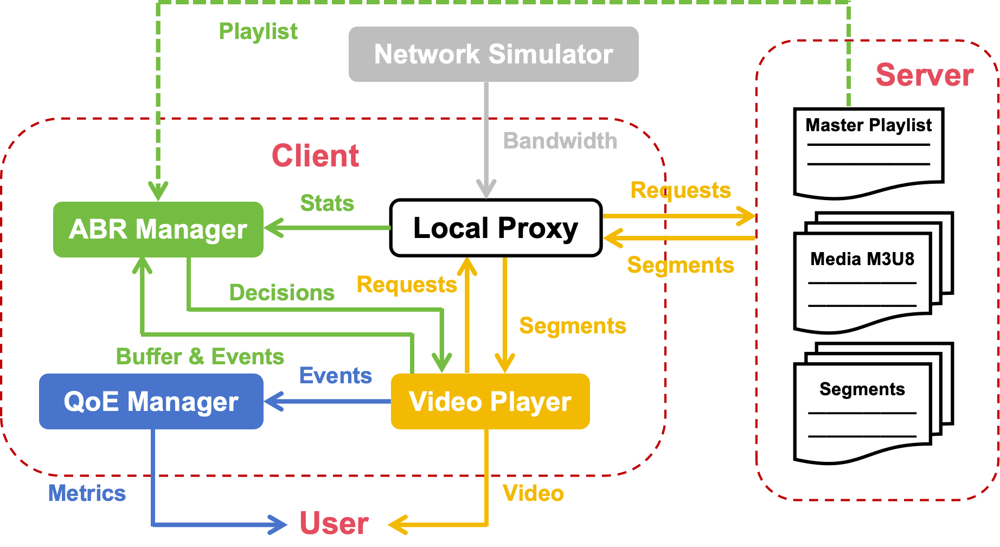

1. 系统架构设计
    1. 整体架构概览
    Stream Smart ABR 系统采用分层架构设计，主要包含以下核心组件:
    
    2. 核心组件详细设计
        1. HLS媒体服务器 (`server.py`)
        功能职责:
            * 提供多码率视频分片的HTTP服务
            * 实现AES-CBC加密传输
            * 支持HLS协议的master.m3u8和media.m3u8播放列表
        技术实现：

            ```python
            class HLSRequestHandler(http.server.BaseHTTPRequestHandler):
                def do_GET(self):
                    # 处理三种类型请求：
                    # 1. master.m3u8 - 主播放列表
                    # 2. media.m3u8 - 媒体播放列表  
                    # 3. .ts分片 - 视频段（AES加密）
            ```
            安全机制：
            * 路径遍历攻击防护
            * AES-CBC加密所有视频分片
            * 跨域访问控制 (CORS)

        2. 本地代理服务器 (`client.py`)
        功能职责：
            * 作为客户端和源服务器之间的透明代理
            * 解密视频分片数据
            * 重写M3U8播放列表URL
            * 监控分片下载性能
        关键实现：
            ```python
            class DecryptionProxyHandler(http.server.BaseHTTPRequestHandler):
                def do_GET(self):
                    # URL路由处理：
                    # / 或 /player.html -> 提供播放器页面
                    # /VIDEO_NAME/master.m3u8 -> 重写主播放列表
                    # /VIDEO_NAME/QUALITY/media.m3u8 -> 重写媒体播放列表
                    # /decrypt_segment?url=... -> 解密并传输分片
            ```
            URL重写机制：
            * 主播放列表：将源服务器URL替换为代理URL
            * 媒体播放列表：将分片URL替换为解密端点
            * 分片请求：添加网络模拟和性能监控
        3. ABR管理器 (`ABR.py`)
        架构设计：
            ```python
            class ABRManager:
                # 支持多种ABR算法
                LOGIC_TYPE_SLBW = "slbw"           # 简单最近带宽
                LOGIC_TYPE_SWMA = "swma"           # 简单移动平均
                LOGIC_TYPE_EWMA = "ewma"           # 指数加权移动平均
                LOGIC_TYPE_BUFFER_ONLY = "buffer_only"         # 纯缓冲区驱动
                LOGIC_TYPE_BANDWIDTH_BUFFER = "bandwidth_buffer" # 带宽+缓冲区混合
                LOGIC_TYPE_COMPREHENSIVE = "comprehensive_rules" # 综合规则算法
                LOGIC_TYPE_DQN = "dqn_rl"          # 深度强化学习
            ```
            状态管理：

            * 分片下载统计 (`segment_download_stats`)
            * 带宽历史记录 (`bandwidth_history_for_trend`)
            * 缓冲区状态 (`current_player_buffer_s`)
            * 切换控制 (`last_switch_time`, `MIN_SWITCH_INTERVAL`)
        4. 网络模拟器 (`network_simulator.py`)
        场景设计:
            ```python
            def create_default_simulation_scenario(mode):
                # Mode 1-9: 不同网络条件模拟
                # Mode 1: 低带宽波动
                # Mode 2: 高带宽波动
                # Mode 3: 快速大幅波动
                # Mode 4: 突发深跌恢复
                # Mode 5-6: 渐进式变化
                # Mode 7-8: V形和A形变化
                # Mode 9: 综合测试场景
            ```
            带宽控制：
            ```python
            def throttle_data_transfer(data_to_send, target_bps, output_stream):
                # 精确的带宽限制算法
                # 4KB块传输 + 延迟控制
                # 支持网络波动模拟
            ```
        5. QoE评估系统 (`QoE.py`)
            QoE计算模型：
            基于ITU-T标准的QoE量化公式
            $$QoE = \sum q(R_k)\cdot T_k - \mu \cdot \sum T_{stall} - \tau\cdot\sum |q(R_{i+1}) - q(R_i)|
            $$
            其中：
            $q(R_k) = \log(resolution_k/360)$ - 质量映射函数
            $T_k$ - 在质量级别k的播放时间
            $\mu = 2.8$ - 卡顿惩罚系数
            $\tau = 1.0$ - 切换惩罚系数
    3. 通信机制设计
        1. WebSocket双向通信
        消息类型定义：
            ```python
            // 客户端 → 服务端
            {
                "type": "QOE_EVENT",
                "data": {
                    "event": "STARTUP_LATENCY|REBUFFERING_START|REBUFFERING_END|QUALITY_SWITCH|BUFFER_UPDATE",
                    "value": number,
                    "timestamp": timestamp_ms
                }
            }

            // 服务端 → 客户端
            {
                "type": "SET_LEVEL|NETWORK_SIM_UPDATE|ABR_BW_ESTIMATE_UPDATE|ABR_NETWORK_STATE_UPDATE",
                "data": { ... }
            }
            ```
        2. 线程同步机制
        多线程协调：
            * 主线程：应用控制和信号处理
            * HTTP代理线程：处理视频请求
            * WebSocket线程：实时通信
            * ABR决策线程：周期性码率调整
            * 网络模拟线程：带宽场景播放
        线程安全：
            ```python
            self._internal_lock = threading.Lock()  # ABR状态保护
            g_simulation_lock = threading.Lock()     # 网络模拟保护
            ```
2. 分片协议格式设计
    1. HLS协议扩展
        1. Master播放列表格式
            ```
            #EXTM3U
            #EXT-X-VERSION:3
            #EXT-X-STREAM-INF:BANDWIDTH=864000,RESOLUTION=640x360,CODECS="avc1.42c01e,mp4a.40.2"
            360p-800k/bbb_sunflower-360p-800k.m3u8
            #EXT-X-STREAM-INF:BANDWIDTH=1596000,RESOLUTION=854x480,CODECS="avc1.4d001e,mp4a.40.2"
            480p-1500k/bbb_sunflower-480p-1500k.m3u8
            #EXT-X-STREAM-INF:BANDWIDTH=4128000,RESOLUTION=1280x720,CODECS="avc1.4d001f,mp4a.40.2"
            720p-4000k/bbb_sunflower-720p-4000k.m3u8
            #EXT-X-STREAM-INF:BANDWIDTH=8192000,RESOLUTION=1920x1080,CODECS="avc1.640028,mp4a.40.2"
            1080p-8000k/bbb_sunflower-1080p-8000k.m3u8
            #EXT-X-STREAM-INF:BANDWIDTH=16256000,RESOLUTION=3840x2160,CODECS="avc1.640033,mp4a.40.2"
            2160p-16000k/bbb_sunflower-2160p-16000k.m3u8
            ```
        2. Media播放列表格式
            ```
            #EXTM3U
            #EXT-X-VERSION:3
            #EXT-X-TARGETDURATION:5
            #EXT-X-MEDIA-SEQUENCE:0
            #EXT-X-PLAYLIST-TYPE:VOD
            #EXTINF:5.000000,
            bbb_sunflower-1080p-8000k-00000.ts
            #EXTINF:5.000000,
            bbb_sunflower-1080p-8000k-00001.ts
            ...
            #EXT-X-ENDLIST
            ```
    2. 加密传输协议
        1. AES-CBC加密方案
            加密流程：
            ```python
            def aes_encrypt_cbc(plaintext: bytes, key: bytes) -> bytes:
                iv = generate_iv()  # 16字节随机IV
                padder = padding.PKCS7(128).padder()
                padded_data = padder.update(plaintext) + padder.finalize()
                cipher = Cipher(algorithms.AES(key), modes.CBC(iv), backend=default_backend())
                encryptor = cipher.encryptor()
                ciphertext = encryptor.update(padded_data) + encryptor.finalize()
                return iv + ciphertext  # IV + 密文
            ```
            密钥管理：

            * 预共享密钥存储在aes.key文件
            * 支持128位和256位AES密钥
            * 每个分片使用随机IV确保安全性
        2. 分片传输格式
            HTTP请求格式：
            ```
            GET /decrypt_segment?url=<encoded_original_url> HTTP/1.1
            Host: localhost:8082
            ```
            HTTP响应格式：
            ```            
            HTTP/1.1 200 OK
            Content-Type: video/MP2T
            Content-Length: <decrypted_size>
            Access-Control-Allow-Origin: *
            
            <decrypted_ts_data>
            ```
    3. URL重写机制
        1. 代理URL映射
        原始URL → 代理URL转换：
            ```
            # 主播放列表重写
            original: http://127.0.0.1:8081/bbb_sunflower/master.m3u8
            proxied:  http://127.0.0.1:8082/bbb_sunflower/master.m3u8
            
            # 媒体播放列表重写  
            original: http://127.0.0.1:8081/bbb_sunflower/1080p-8000k/playlist.m3u8
            proxied:  http://127.0.0.1:8082/bbb_sunflower/1080p-8000k/playlist.m3u8
            
            # 分片URL重写
            original: http://127.0.0.1:8081/bbb_sunflower/1080p-8000k/segment-00001.ts
            proxied:  http://127.0.0.1:8082/decrypt_segment?url=<encoded_original_url>
            ```
3. ABR算法流程设计

    1. 算法分类体系
        1. 基础启发式算法
            * SLBW (Simple Last Bandwidth)
                ```python
                def _logic_slbw(self):
                    estimated_bw_bps = self._get_last_segment_throughput()
                    safety_factor = 0.8
                    target_bitrate_bps = estimated_bw_bps * safety_factor
                    # 选择最高可支持的码率级别
                ```
            * SWMA (Simple Moving Window Average)
                ```python
                def _logic_swma(self):
                    estimated_bw_bps = self._get_swma_throughput()
                    safety_factor = 0.85
                    # 使用最近N个分片的平均吞吐量
                ```

            * EWMA (Exponentially Weighted Moving Average)
                ```python
                def _logic_ewma(self):
                    estimated_bw_bps = self._get_ewma_throughput()
                    safety_factor = 0.9
                    # 指数平滑的带宽估计
                ```

        2. 缓冲区感知算法
            Buffer-Only算法：
            ```python
            def _logic_buffer_only(self):
                BUFFER_LOW_FOR_DOWNGRADE = 10.0   # 降级阈值
                BUFFER_HIGH_FOR_UPGRADE = 25.0    # 升级阈值
                
                if current_buffer_s > BUFFER_HIGH_FOR_UPGRADE:
                    next_best_index = min(current_level_index + 1, max_level)
                elif current_buffer_s < BUFFER_LOW_FOR_DOWNGRADE:
                    next_best_index = max(current_level_index - 1, 0)
            ```
            Bandwidth-Buffer混合算法：
            ```python
            def _logic_bandwidth_buffer(self):
                # 动态安全系数调整
                if current_buffer_s < BUFFER_THRESHOLD_EMERGENCY:
                    dynamic_safety_factor = 0.4      # 紧急情况
                elif current_buffer_s < BUFFER_THRESHOLD_LOW:
                    dynamic_safety_factor = 0.6      # 低缓冲
                elif current_buffer_s > BUFFER_THRESHOLD_HIGH:
                    dynamic_safety_factor = 1.0      # 高缓冲，激进策略
                else:
                    dynamic_safety_factor = 0.8      # 正常情况
            ```
        3. 综合规则算法
            网络状态分析：
            ```python
            def get_network_analysis_features(self):
                features = {
                    'mean_bw_bps': np.mean(bitrates),
                    'std_dev_bw_bps': np.std(bitrates),
                    'coeff_variation': std_dev / mean_bw,
                    'slope_bps_per_s': linear_regression_slope,
                    'trend': "INCREASING|DECREASING|STABLE|SUDDEN_DROP",
                    'is_sudden_drop': latest_bw < mean_bw * (1 - drop_ratio),
                    'is_volatile': coeff_variation > threshold
                }
            ```
            决策逻辑流程：
            ```python
            def _logic_comprehensive_rules(self):
                # 1. 网络状态分析
                network_features = self.get_network_analysis_features()
                
                # 2. 动态安全系数计算
                if network_features['is_sudden_drop']:
                    safety_factor = 0.5
                elif network_features['is_volatile']:
                    safety_factor = 0.65
                elif network_features['trend'] == "INCREASING":
                    safety_factor = 0.9
                else:
                    safety_factor = 0.85
                
                # 3. 多维度决策
                # - 带宽预测修正
                # - 缓冲区状态评估  
                # - 切换平滑性控制
                # - 突发情况处理
            ```

        4. 深度强化学习算法
            DQN网络架构：
            ```python
            class DQNNetwork(nn.Module):
                def __init__(self, state_size=5, action_size=5, hidden_size=128):
                    self.fc1 = nn.Linear(state_size, hidden_size)
                    self.fc2 = nn.Linear(hidden_size, hidden_size) 
                    self.fc3 = nn.Linear(hidden_size, hidden_size)
                    self.fc4 = nn.Linear(hidden_size, action_size)
            ```

            状态空间设计：
            ```python
            state = np.array([
                bandwidth_mbps,           # 当前带宽估计
                buffer_level,             # 缓冲区长度(秒)
                current_bitrate_level,    # 当前比特率等级(归一化)
                recent_download_time,     # 最近下载时间
                success_rate             # 下载成功率
            ])
            ```

            QoE导向奖励函数：
            ```python
            def calculate_qoe_reward(self, old_state, action, new_state):
                # 1. 质量奖励
                quality_reward = (selected_bitrate / max_bitrate) * 10
                
                # 2. 缓冲区健康度
                if 10.0 <= buffer_level <= 20.0:
                    buffer_reward = 5.0  # 理想区间
                elif buffer_level < 2.0:
                    buffer_reward = -50.0  # 严重卡顿惩罚
                
                # 3. 切换平滑性
                switch_penalty = -abs(action - current_action) * 2.0
                
                # 4. 带宽效率
                utilization = selected_bitrate / estimated_bandwidth
                if 0.7 <= utilization <= 0.9:
                    bandwidth_efficiency = 3.0
                
                return quality_reward + buffer_reward + switch_penalty + bandwidth_efficiency
            ```
    2. 决策执行流程
        1. ABR主循环
            ```python
            def abr_loop(self):
                while not self.stop_abr_event.is_set():
                    try:
                        # 1. 检查是否有新的分片下载数据
                        self._abr_decision_logic()
                        
                        # 2. 广播带宽估计（如果有回调）
                        if self.broadcast_bw_estimate:
                            current_bw_mbps = self.estimated_bandwidth_bps / 1_000_000
                            self.broadcast_bw_estimate(current_bw_mbps)
                        
                        # 3. 广播网络状态（如果启用综合算法）
                        if self.logic_type == self.LOGIC_TYPE_COMPREHENSIVE:
                            network_features = self.get_network_analysis_features()
                            if self.broadcast_network_state:
                                self.broadcast_network_state(network_features)
                        
                        # 4. DQN训练（如果启用）
                        if self.logic_type == self.LOGIC_TYPE_DQN:
                            self.train_dqn()
                        
                        # 5. 等待下一次决策周期
                        self.stop_abr_event.wait(timeout=2.0)
                        
                    except Exception as e:
                        logger.error(f"ABR loop error: {e}", exc_info=True)
            ```
        2. 切换决策执行
            ```python
            def _execute_switch_decision(self, next_best_index, current_logic_name, 
                                       decision_rationale_log="", is_emergency=False):
                # 1. 切换抑制检查
                current_min_switch_interval = self.MIN_SWITCH_INTERVAL
                if is_emergency:
                    current_min_switch_interval = 0.5  # 紧急情况允许快速切换
                
                if time.time() - self.last_switch_time < current_min_switch_interval:
                    return  # 抑制过于频繁的切换
                
                # 2. 执行切换
                self.last_switch_time = time.time()
                old_stream_info = self.available_streams[self.current_stream_index_by_abr]
                self.current_stream_index_by_abr = next_best_index
                new_stream_info = self.available_streams[next_best_index]
                
                # 3. 更新内部状态
                self._update_current_abr_selected_url_logging()
                
                # 4. 记录决策日志
                logger.info(f"ABR DECISION ({current_logic_name}): Switch from level "
                            f"{old_level} to {next_best_index}. {decision_rationale_log}")
                
                # 5. 广播切换命令
                self.broadcast_abr_decision(self.current_stream_index_by_abr)
            ```
    3. 性能监控与反馈
        1. 分片下载监控
            ```python
            def add_segment_download_stat(self, url, size_bytes, duration_seconds):
                if duration_seconds > 1e-5:
                    throughput_bps = (size_bytes * 8) / duration_seconds
                    
                    stat_entry = {
                        'url': url,
                        'size': size_bytes,
                        'duration': duration_seconds,
                        'throughput_bps': throughput_bps,
                        'timestamp': time.time()
                    }
                    
                    # 更新带宽估计
                    self._update_bandwidth_estimates(throughput_bps)
                    
                    # 限制历史记录大小
                    if len(self.segment_download_stats) > self.max_bw_stats_history:
                        self.segment_download_stats.pop(0)
            ```
        2. QoE实时评估
            ```python
            class QoEMetricsManager:
                def record_quality_switch(self, from_level, to_level, to_bitrate, timestamp):
                    self.update_time_at_level(timestamp)
                    
                    log_entry = {
                        'timestamp': timestamp,
                        'from_level': from_level,
                        'to_level': to_level,
                        'to_bitrate': to_bitrate
                    }
                    self.quality_switches_log.append(log_entry)
                    self.current_level_index = to_level
                    
                def record_rebuffering_start(self, timestamp):
                    self.update_time_at_level(timestamp)
                    self.rebuffering_events.append({
                        'start_ts': timestamp,
                        'duration_ms': 0,
                        'end_ts': None
                    })
            ```
    4. 算法性能对比
        1. 测试框架
        ```python
        # control.py - 自动化测试控制
        parameter_combinations = [
            [abr_algorithm_id, network_scenario_id]
            # 支持多算法 × 多场景的矩阵测试
        ]
        
        for params in parameter_combinations:
            command = ['python', './src/client.py', 
                       str(params[0]), str(params[1]), output_path]
            subprocess.run(command, timeout=120)  # 2分钟测试
        ```
        2. 评估指标
        QoE综合得分：
        ```python
        final_qoe_score = (
            qoe_total_quality_term - 
            qoe_rebuffering_penalty_term - 
            qoe_switch_penalty_term
        )
        ```
